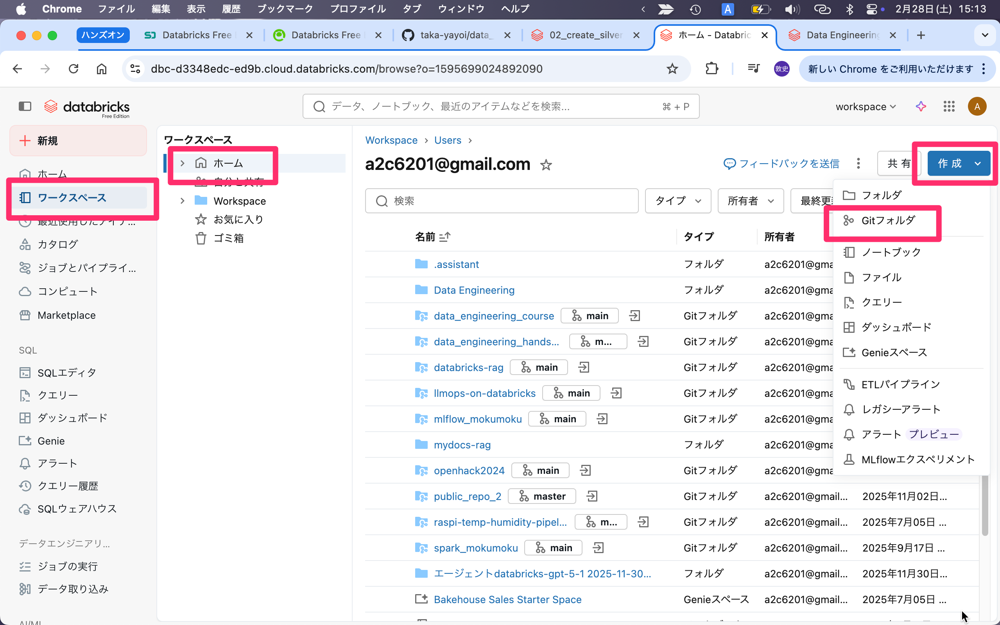
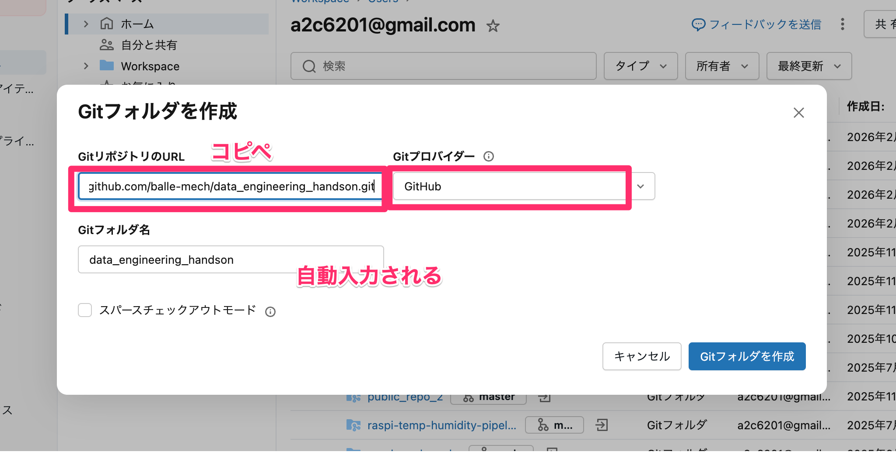
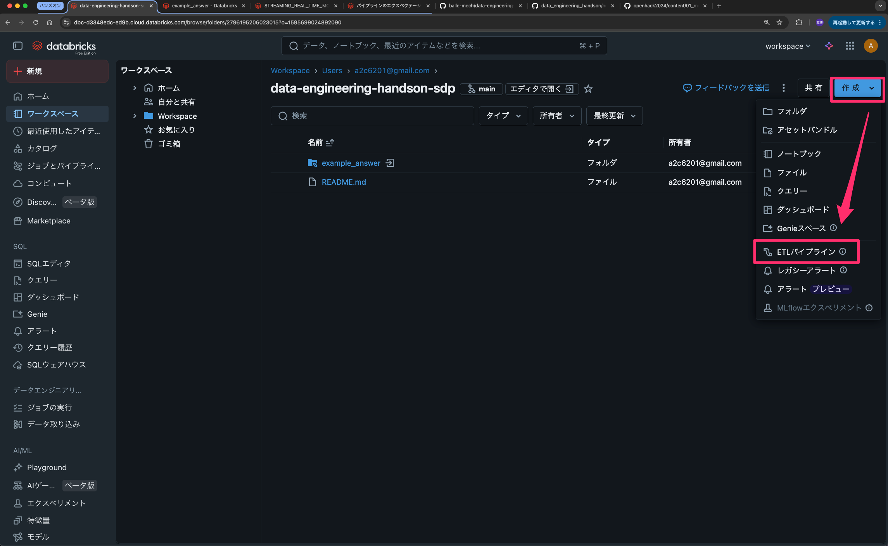
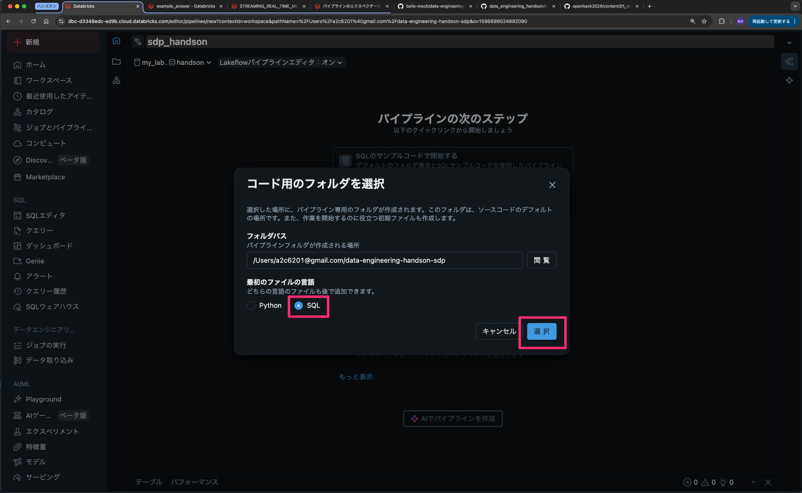
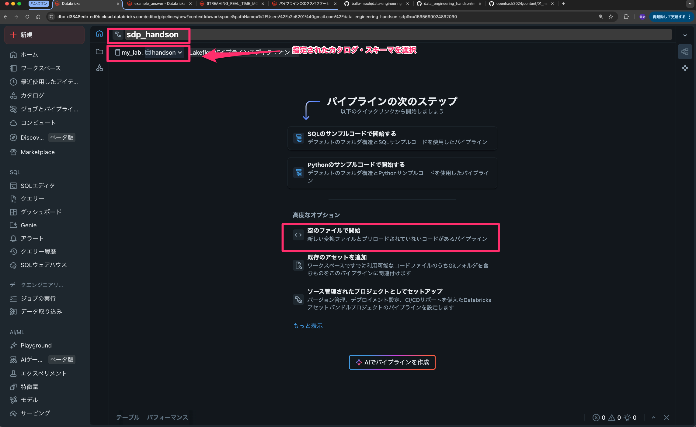
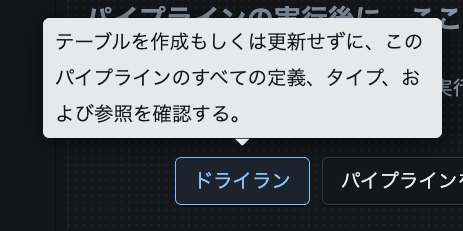
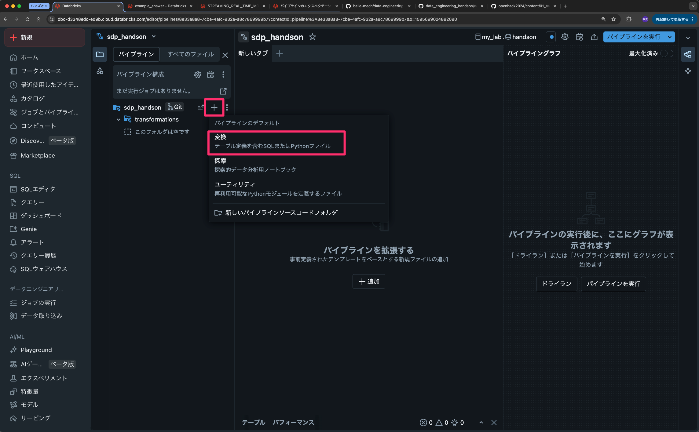
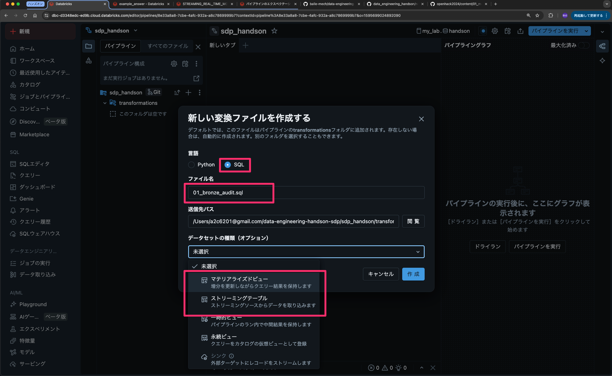

# データエンジニアリングハンズオン(Spark Declarative Pipelines編)

[GitHub｜データエンジニアリングハンズオンNotebook編](https://github.com/balle-mech/data_engineering_handson)の続編です。

## フォルダ構造

```
data_engineering_handson/
├── README.md                      # このリポジトリ全体の説明ファイル
├── ハンズオンガイド(SDP編).md        # こちらを参照しながら進めてください。
├── example_answer/                # 正解例・サンプルコード
└── sdp_handson/           # ハンズオンで作成するフォルダ、このフォルダ内で作業をする
    └── transformations/   # ハンズオンを進める中で自動作成されるフォルダ
```

---

## ハンズオンで最終的に作りたいもの（BIゴールイメージ）

- 目的: `監査ログ(audit)` と `課金実績(usage)` を統合し、**誰が・何を・どれだけ使ったか**を可視化できるテーブルの作成
  - BIダッシュボードは対象外
- 扱うデータ
  - `audit_dirty.csv`：ログ
  - `usage_dirty.csv`：利用料
  - `user_list.csv`：ユーザー一覧
- 主な分析テーマ例
  - 全体サマリ
    - 日次別DBU、日次アクティブユーザー、日次アクセス数
  - ユーザー分析
    - ユーザー別利用量（DBU）ランキング
    - workspaceごとの利用料
  - リソース分析
    - テーブル別アクセス数、利用ユーザー数

### このハンズオンで参考にするメダリオンアーキテクチャの考え方

[GitHub｜Fukunaga｜メダリオンアーキテクチャ参考.md](https://github.com/balle-mech/data_engineering_handson/blob/main/%E3%83%A1%E3%83%80%E3%83%AA%E3%82%AA%E3%83%B3%E3%82%A2%E3%83%BC%E3%82%AD%E3%83%86%E3%82%AF%E3%83%81%E3%83%A3%E5%8F%82%E8%80%83.md)

## 手順サマリ

1. ハンズオンGitフォルダをクローン
2. ETLパイプラインフォルダ・ファイルを作成
3. Auditのブロンズ・シルバー・ゴールド作成
4. 余力がある方は）Usageのブロンズ・シルバー・ゴールド作成

## 準備手順

### ハンズオンGitフォルダをクローン

以下リンクをコピー

> https://github.com/balle-mech/data_engineering_handson.git



コピーしたリンクを貼り付け



### ETLパイプラインフォルダ・ファイルを作成

#### ETLパイプラインフォルダ作成







**※ドライランとは**



#### ETLパイプライン用のsqlファイル作成方法




データセットの種類は「未選択」でも可

**作成するファイル名**

```
01_bronze_audit.sql
```

→　ストリーミングテーブル

```
02_silver_audit.sql
```

→　ストリーミングテーブル

```
03_gold_audit_table_daily.sql
```

→　マテリアライズドビュー

## スキーマ設計（例）

### Bronze Audit

#### スキーマ定義

- テーブル名：sdp_bronze_audit
- カラム：
  - event_id
  - event_time,
  - action_name,
  - resource_name,
  - source_ip,
  - user,
  - request_params,
  - current_timestamp AS \_ingest_timestamp,
  - \_metadata.file_path AS \_datasource

#### 要件

- STRINGで保持（ストリーミングテーブル作成時に特段型の設定は必要無い）
- カラムのズレを修正
  - ダブルクォートで囲まれたフィールド内のカンマを区切り文字として扱わないように

### Silver Audit

#### スキーマ定義

- テーブル名: sdp_silver_audit
- 主キー候補: `event_id`
- カラム:
  - `event_id` STRING
  - `event_time` TIMESTAMP
  - `action_name` STRING
  - `user_email` STRING（`user` JSON展開）
  - `user_name` STRING（`user` JSON展開）
  - `resource_name` STRING
  - `full_name_arg` STRING（`request_params` JSON展開）
  - `_ingest_timestamp` TIMESTAMP

#### 加工要件

- JSON展開
  - `user` から `user_email`, `user_name`
- null除去（SDPのExpectations機能）:
  - `event_time`, `action_name`, `email` がnullの行を除外
- 値前後の空白除去:
  - `trim` を `action_name`, `resource_name`, `email` へ適用
- 重複除去（AUTO CDC INTO 利用）:
  - `event_id` を一意にして重複排除

Usageまでやりたい方は、[GitHub｜受講者向けハンズオンガイド（Notebook編）#スキーマ設計](<https://github.com/balle-mech/data_engineering_handson/blob/main/notebooks/%E3%83%8F%E3%83%B3%E3%82%BA%E3%82%AA%E3%83%B3%E3%82%AC%E3%82%A4%E3%83%89(Notebook%E7%B7%A8).md#%E3%82%B9%E3%82%AD%E3%83%BC%E3%83%9E%E8%A8%AD%E8%A8%88%E7%9B%AE%E6%A8%99>)を参照。

### Gold Audit

例）テーブル別アクセス数・利用ユーザー数（リソース分析）

`gold_audit_table_daily`

目的：テーブル別アクセス数、利用ユーザー数（リソース分析）
スキーマ例：

```
event_date DATE                          # 監査ログ基準日（日単位）
table_name STRING                        # アクセス対象テーブル名
audit_event_count LONG                   # テーブルへの総アクセス回数
distinct_user_count LONG                 # そのテーブルにアクセスしたユニークユーザー数
get_table_count LONG                     # getTable操作回数
command_submit_count LONG                # commandSubmit操作回数
```

# SDP参考

## 演習2: Lakeflow SDP 宣言型パイプライン（25分）

**リファレンス**: `pipelines/pipeline_basic.sql`

### 実行方法

#### Step 1: パイプラインを作成

1. 左サイドバーで **新規** → **ETL パイプライン** を選択
2. パイプライン名を入力（例: `sdp_nyctaxi_pipeline`）
3. カタログ/スキーマを設定:
   - **カタログ**: `workspace`
   - **スキーマ**: 新規作成（例: `sdp_handson_<あなたの名前>`）
4. **空のファイルから開始** を選択
5. 言語は **SQL** を選択
6. **選択** をクリック

#### Step 2: SQLを入力

パイプラインエディタが開いたら、以下のSQLを入力:

```sql
-- Bronze層
CREATE MATERIALIZED VIEW bronze_trips AS
SELECT * FROM samples.nyctaxi.trips;

-- Silver層
CREATE MATERIALIZED VIEW silver_trips AS
SELECT
    tpep_pickup_datetime,
    tpep_dropoff_datetime,
    trip_distance,
    fare_amount,
    pickup_zip,
    dropoff_zip,
    DATE(tpep_pickup_datetime) AS pickup_date
FROM bronze_trips
WHERE fare_amount > 0
  AND trip_distance > 0;

-- Gold層
CREATE MATERIALIZED VIEW gold_daily_trips AS
SELECT
    pickup_date,
    COUNT(*) AS trip_count,
    ROUND(SUM(fare_amount), 2) AS total_fare,
    ROUND(AVG(fare_amount), 2) AS avg_fare,
    ROUND(AVG(trip_distance), 2) AS avg_distance
FROM silver_trips
GROUP BY pickup_date
ORDER BY pickup_date;
```

#### Step 3: 実行

1. **パイプラインを実行** ボタンをクリック
2. 右側のDAG（依存関係グラフ）で進行状況を確認
3. 完了後、各テーブルをクリックしてデータをプレビュー

### 学習内容

- `CREATE MATERIALIZED VIEW` によるテーブル定義
- 依存関係の自動解決
- パイプラインエディタの使い方

---

## 演習3: エクスペクテーションの追加（15分）

**リファレンス**: `pipelines/pipeline_with_expectations.sql`

### 実行方法

#### 方法A: 既存パイプラインを編集

1. 演習2で作成したパイプラインを開く
2. Silver層の定義を以下に変更:

```sql
CREATE MATERIALIZED VIEW silver_trips (
    CONSTRAINT valid_fare EXPECT (fare_amount > 0) ON VIOLATION DROP ROW,
    CONSTRAINT valid_distance EXPECT (trip_distance > 0) ON VIOLATION DROP ROW,
    CONSTRAINT warn_high_fare EXPECT (fare_amount < 500)
) AS
SELECT
    tpep_pickup_datetime,
    tpep_dropoff_datetime,
    trip_distance,
    fare_amount,
    pickup_zip,
    dropoff_zip,
    DATE(tpep_pickup_datetime) AS pickup_date
FROM bronze_trips;
```

3. **パイプラインを実行** をクリック

#### Step 4: 品質メトリクスを確認

1. パイプライングラフで `silver_trips` をクリック
2. 下部パネルの **テーブル指標** タブを確認
3. エクスペクテーションの達成/未達成を確認

### エクスペクテーションの3つのモード

| モード   | 構文                                     | 動作                   |
| -------- | ---------------------------------------- | ---------------------- |
| 警告のみ | `EXPECT (条件)`                          | 警告を記録、処理は継続 |
| 行を除外 | `EXPECT (条件) ON VIOLATION DROP ROW`    | 違反行を除外           |
| 失敗     | `EXPECT (条件) ON VIOLATION FAIL UPDATE` | パイプライン停止       |

---

## 演習4: Lakeflowジョブによる自動化（15分）

**参考資料**: `notebooks/exercise_part4_jobs.py`

### 実行方法

#### Step 1: ジョブを作成

1. 左メニューから **ワークフロー** を選択
2. **ジョブを作成** をクリック
3. タスク設定:
   - **タスク名**: `run_pipeline`
   - **タイプ**: `パイプライン`
   - **パイプライン**: 演習2または演習3のパイプラインを選択
4. ジョブ名を設定（画面上部の「名前のないジョブ...」をクリック）

#### Step 2: スケジュール設定（オプション）

1. 右側パネルの **スケジュールとトリガー** で **トリガーを追加**
2. **スケジュール済み** を選択し、頻度を設定（例: 毎日 06:00）
3. ⚠️ 演習後は **一時停止** にしておく

#### Step 3: 手動実行

1. **今すぐ実行** をクリック
2. **実行** タブで実行状況を確認

---

## 演習のポイント

### 命令型 (演習1) vs 宣言型 (演習2-3) の違い

| 観点         | 命令型 (PySpark)                  | 宣言型 (SQL)                         |
| ------------ | --------------------------------- | ------------------------------------ |
| 記述方法     | `df.filter().write.saveAsTable()` | `CREATE MATERIALIZED VIEW AS SELECT` |
| コード量     | 多い                              | 少ない                               |
| 依存関係     | 手動で実行順序を管理              | 自動で解決                           |
| 品質チェック | `.filter()` で自前実装            | `EXPECT` で宣言                      |
| 除外件数     | 自分で計算・ログ出力              | 自動でメトリクス記録                 |

---

## トラブルシューティング

### テーブルが作成されない

- パイプラインが正常に完了しているか確認（緑色のチェックマーク）
- エラーメッセージがあれば内容を確認

### CSVファイルの値が文字化け

VSCodeで開いたとき、日本語が文字化けしてしまうことがあります。

```csv
event_time,event_type,event_name,action_name,user,request_params,resource_name,source_ip
2026-02-02T21:08:36,access,table_access,getTable,"{""email"": ""user00@example.com"", ""name"": ""���X�� ��""}","{""full_name_arg"": ""dev.sales.table_016""}",dev.sales.table_016,10.6.121.14
2026-02-02T23:56:39,access,table_access,getTable,"{""email"": ""user00@example.com"", ""name"": ""���X�� ��""}","{""full_name_arg"": ""prod.sales.table_019""}",prod.sales.table_019,10.4.222.123
```

（userカラムのname部分）

文字コードがUTF-8（）で表示されていることが原因であれば、以下手順でShisft JIS（日本語）に変更することで解消するかもしれません。
**注意：**既に文字化けした状態で保存までされている場合は、この操作では解消できないです。

画面下の「UTF-8」をクリック、「エンコード付きで保存を選択」


---

## 参考リンク

- [Lakeflow SDP入門：基礎から実践まで](https://qiita.com/taka_yayoi/items/e15caec3c71a27aa12b1)
- [SQLだけで始めるLakeflow SDP](https://qiita.com/taka_yayoi/items/e6368446040c9e979d0f)
- [Lakeflow SDPでデータ品質を守るエクスペクテーション](https://qiita.com/taka_yayoi/items/0b525cb05a095ad0bbe1)
